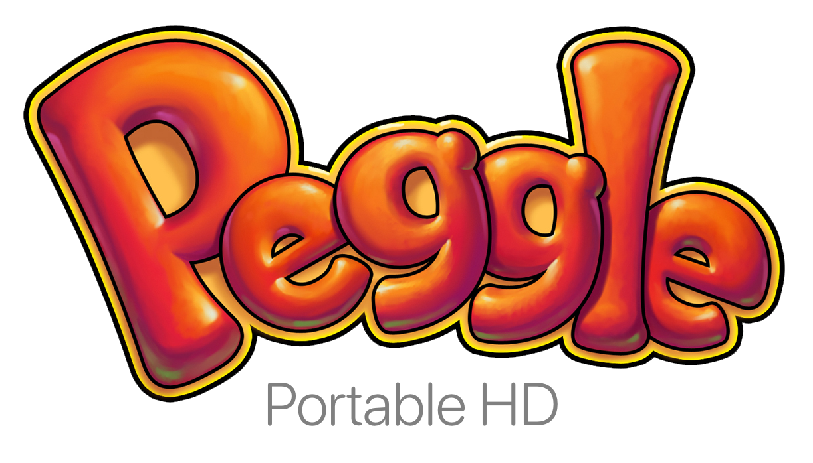
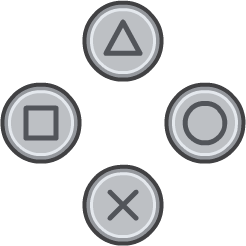
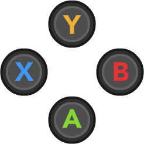
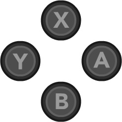

<div align=center>
  
  <p>Peggle Portable HD is a texture pack for the PSP version of Peggle that replaces all of its textures with their higher quality counterparts from the PS3 version of Peggle.</p>

</div>

---


#### Why?
Because Peggle doesn't have an official Nintendo Switch port for some reason.. I play it on my Switch using PPSSPP and I am sick of the horrible quality!

### Features

- Updated UI, Backgrounds, Characters, and more!
- Pixel-perfect HD textures ported straight from the PS3.
- Multiple variants supporting new controllers and layouts.
- KTX2 compression for fast loading, wide support, and small file size.
- HD (720p) Peggle action in your pocket!

### Download
Multiple downloads are available for various controllers and layouts. Download the pack that matches your controller and make sure your controls are mapped correctly.

<div align=center>
<table><thead>
  <tr>
    <th>PlayStation<br>(Default)<br></th>
    <th>Xbox</th>
    <th>Nintendo<br>(Swapped)<br></th>
  </tr></thead>
<tbody>
  <tr>
    <td></td>
    <td></td>
    <td></td>
  </tr>
  <tr>
    <td>Download</td>
    <td>Download</td>
    <td>Download</td>
  </tr>
</tbody>
</table>
</div>

**Nightly**  
To try the latest changes, download the nightly release from [here](). The PlayStation controller layout is applied in the nightly release by default.

### Installation
Extract your chosen release and drag the `NPUG30040` folder to...

- Nintendo Switch  
```
/switch/ppsspp/config/ppsspp/PSP/TEXTURES
```

- macOS (from your home folder)  
```
.config/ppsspp/PSP
```

- iOS   
```
On My iPhone/iPad > PPSSPP > PSP > TEXTURES
```

### More Information
Every texture in this pack was dumped from the PlayStation 3 version of Peggle. For information on how you can do this yourself as well as the tools used, view [info.md](./info.md). Controller button prompts are from [Xelu’s Free Controller Prompts](https://thoseawesomeguys.com/prompts/). 

<div align=center><sub>Peggle is a trademark of Electronic Arts. All rights reserved. This project is not endorsed or affiliated with Electronic Arts in any way.</sub></div>
