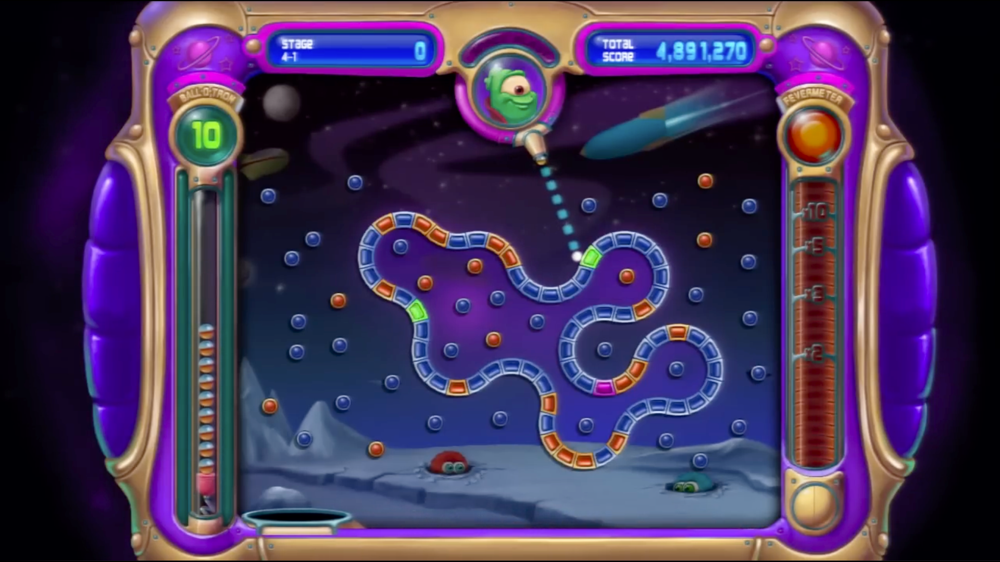
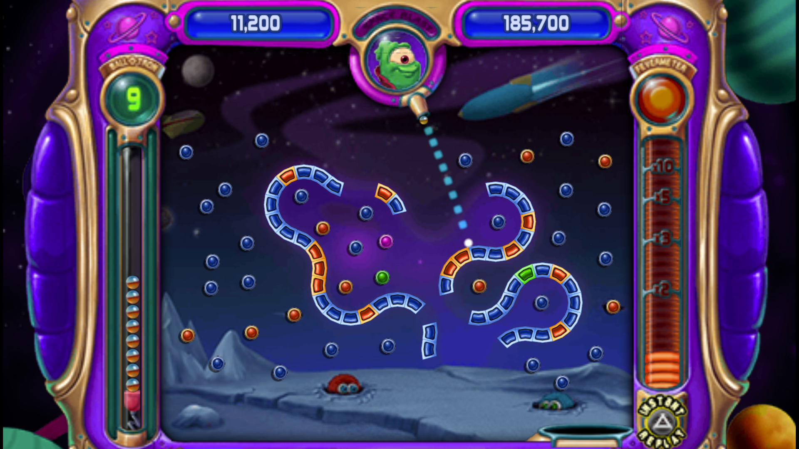
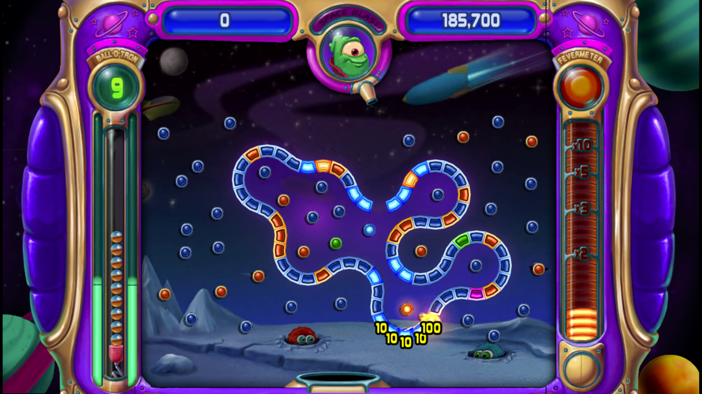

# Information

This page has info all about this texture pack as well as the process of making it.

**On this page**  

Creating the Texture Pack:

1. Tools Used
2. Extracting assets from the PS3 game
3. Dumping the PSP textures

Additional Info:

1. Altered/Fixed Textures
2. Button Prompts

## Creating the Texture Pack

### Tools Used
1. [**PS3 Game Extractor**](https://www.psx-place.com/resources/ps3-game-extractor.824/) • Used to extract `Peggle.pkg` (PS3) game files.
2. [**QuickBMS**](https://github.com/LittleBigBug/QuickBMS) • Used in combination with [**`specialbit.bms`**](http://aluigi.org/bms/specialbit.bms) to dump raw texture files from `peggle.pak`

### Extracting assets from the PS3 game
First, I extracted the textures from Peggle for PS3 using QuickBMS and a script I found in a forum coment, these are the steps I took:

1. Download Peggle (PS3) from NPS
2. Use PS3 Game Extractor to get the `USRDIR` folder from the downloaded `Peggle.pkg`
3. Copy `NPUA30005/USRDIR/data/peggle.pak` to a different location
4. Use QuickBMS and the `specialbit.bms` script to decompress the `peggle.pak` file using the following command:

```
./quickbms specialbit.bms peggle.pak peggle
```

The result will be a `peggle` folder with the contents of `peggle.pak`, which contains all the texture files for Peggle.

### Dumping the PSP textures
>[!NOTE]
>If you want to contribute to this texture pack, make sure you already have the latest nightly release **downloaded *and* enabled**, otherwise your hashes will not be correct and contributions cannot be accepted.

To dump the textures from the PSP version using PPSSPP, navigate to `Settings > Tools > Developer Tools > Texture Replacement` . Turn on the `Save new textures` option.

Now, playing through Peggle normally will dump all textures as they load in.

## Additional Info

### Altered/Fixed Textures
Some textures were altered from their original PSP/PS3 versions to fit them on screen better. Due to how old the PS3 port was, it had to support 1080p and 720p resolutions, which caused some textures to be improperly scaled. The PSP port used the PS3 port as a base, but with a bigger, more zoomed in playing area, among other UI changes.

| PS3 | PSP |
| :-: | :-: |
|  | 

This means that some background elements (like, in ths example, the planets) are too large to be fully seen on the PSP version and are completely missing on the PS3. Peggle Portable HD fixes this by using down-scaled textures to fit them better on screen at their best quality.

| Peggle Portable HD |
| :----------------: |
| 

### Button Prompts
Peggle Portable HD supports PlayStation, Xbox, and Nintendo Switch controllers (and maybe more eventually). The button prompts used are from [Xelu's Free Controller Prompts](https://thoseawesomeguys.com/prompts/).

If you are using a Nintendo Switch controller, the A/B/X/Y buttons are unswapped, meaning X should be mapped to A, O should be mapped to B, etc.
